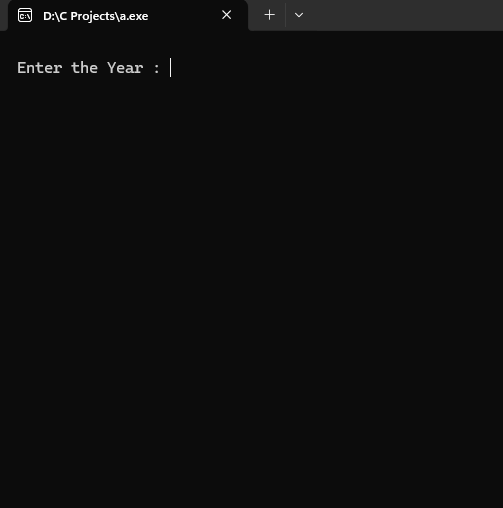
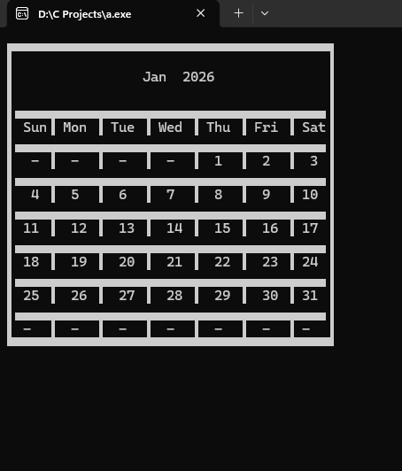
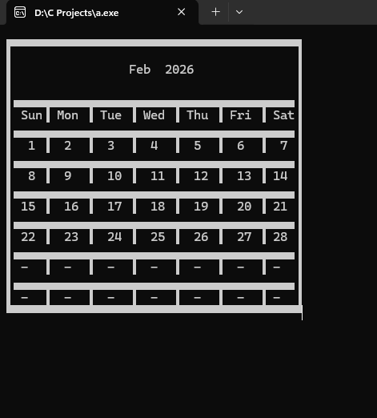
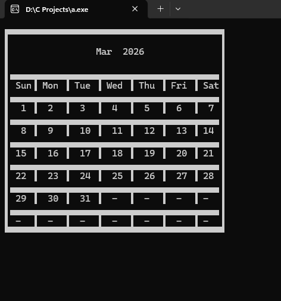
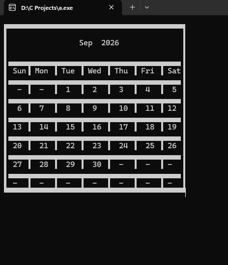

# 📅 Calendar Application in C

## 📌 Overview

The **Calendar Application** is a console-based program developed using the **C programming language** that generates the calendar for a given year.

The program takes a **year as input** and displays the monthly calendar in a structured format. Users can **navigate between months using the left and right arrow keys**, making it easy to browse the entire year's calendar.

This project demonstrates fundamental programming concepts such as **loops, conditional logic, date calculations, and keyboard input handling**.

---

## 🚀 Features

* Accepts **any year as input**
* Generates the **complete calendar for all 12 months**
* Navigate between months using **Left (←) and Right (→) arrow keys**
* Displays dates in a **clean tabular calendar format**
* Interactive **console-based interface**

---

## 🛠️ Technologies Used

* **C Programming Language**
* Standard C Libraries
* Console Input/Output

---

## 📂 Project Structure

```
calendar-project
│
├── calendar.c
├── README.md
└── screenshots
```

---

## ▶️ How to Run the Program

### 1️⃣ Compile the program

```
gcc Calendar.c -o Calendar
```

### 2️⃣ Run the program

```
./Calendar
```

### 3️⃣ Enter the year when prompted

```
Enter the Year: 2026
```

Use the **arrow keys** to navigate between months.

---

## 🖥️ Example Output

### Input Screen



### January Calendar



### February Calendar



### March Calendar



### September Calendar



---

## 🎯 Learning Outcomes

Through this project I practiced and improved my understanding of:

* C programming fundamentals
* Date and calendar calculations
* Keyboard input handling
* Console-based UI formatting
* Structured program design

---

## 📌 Future Improvements

* Add **color formatting for better visualization**
* Allow **direct month selection**
* Add **holiday highlighting**
* Export calendar to **text file**

---

## 👨‍💻 Author

**Kesavan**

Aspiring **Frentend Developer** passionate about building software and solving problems with code.

